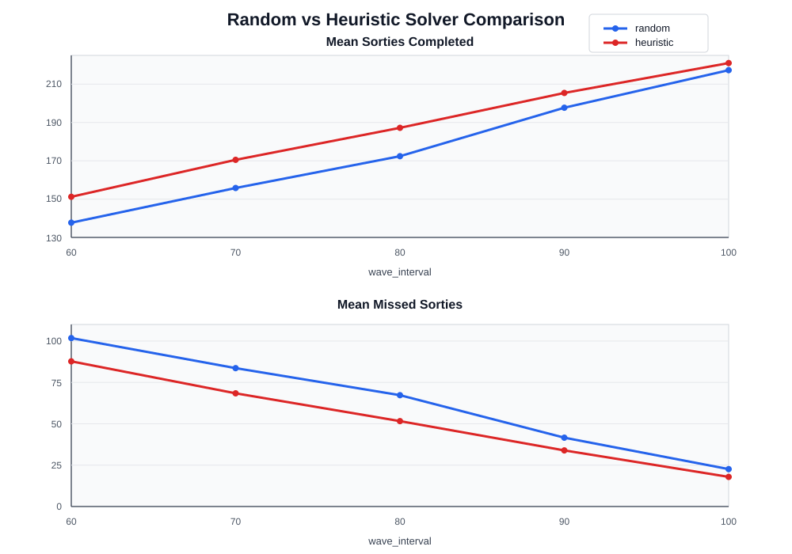

# 航母甲板调度：模型、求解与一些观察

相关文件：

- 环境：`env/carrier_aircraft_env.py`
- 配置：`env/config.py`
- 随机策略：`solution/random_solver.py`
- 启发式策略：`solution/heuristic_solver.py`
- 求解入口：`solve.py`

## 1. 当前环境

环境已经从"单轮全部放飞结束"改为了多波次固定时长仿真。

默认 40 架飞机，分 A、B 两组各 20 架。波次按 A/B 交替：当前波次一组放飞，上一轮已在空中的另一组回收。飞机如果错过本组当前放飞窗口，记一次 `missed_sortie`，等下一轮本组波次再尝试。

核心评估指标：

- `total_sorties_completed`：累计完成放飞架次
- `total_missed_sorties`：累计错过波次数
- `total_reward`：环境累计奖励

高层动作四类：

| 动作编号 | 动作 | 含义 |
|---:|---|---|
| 0 | R | 回收 |
| 1 | F | 加油 |
| 2 | M | 挂弹 |
| 3 | L | 放飞 |

## 2. 相比真实系统的简化

当前模型不是完整的舰面作业仿真，而是保留主要资源耦合后的调度环境。简化主要在：

- 目标从单轮 C_max 最小化，改为固定时长内最大化出动、减少 missed sorties
- 40 架飞机，A/B 两组，未展开备用机、机库机和机型差异
- 波次固定 A/B 交替，不建模空中等待油量、返航窗口约束和盘旋容量
- 回收与放飞均为单通道固定时间（1 min）
- 回收后停放为即时完成，没有牵引车、滑行路径和停机位阻塞
- 加油建模为服务站 + 人员 + 正态分布时间，没有油车路径和补给链
- 挂弹已加入弹药准备、下层升降机、上层升降机、挂弹车转运和逐弹挂载，但还没有弹药型号、库存、装配区容量和路径冲突
- 人员占用是聚合式的，不是严格按作业阶段释放

## 3. 当前挂弹链路

飞机回收完成时，采样下一轮所需挂弹数量：

```text
q_i ∈ {1, 2, 3, 4}
P(1)=0.3, P(2)=0.4, P(3)=0.2, P(4)=0.1
```

链路分两段：

1. 弹药准备 + 下层升降机：`U(5, 10) + N(3, 0.5²)`
2. 上层升降机 + 甲板转运 + 逐弹挂载：`N(3, 0.5²) + spot_transfer_time + Σ N(5, 2)`

停机位转运时间采用每层 2 个停机位的简化拓扑：

```text
spot 0:           2 min
spot 1, 2:        3 min
spot 3, 4:        4 min
spot 5, 6:        5 min
...
```

## 4. Random 策略

实现：`solution/random_solver.py`

两步：
1. 从合法高层动作中均匀随机选一个
2. 在该动作对应的合法飞机中均匀随机选一架

依赖 action mask 保证合法性，但不考虑 deadline、剩余时间、资源占用和 miss 风险。是实验中的基线。

## 5. Heuristic 策略

实现：`solution/heuristic_solver.py`

面向多波次出动目标设计。核心思路：优先完成更可能赶上当前或最近放飞窗口的飞机，而不是优先救最难完成的飞机。

主要规则：

- 有可放飞飞机就立即放飞，释放弹射器和停机位
- 加油/挂弹优先于回收，保持整备流水线运转
- 加油和挂弹之间根据人员占用和 slack 做平衡
- 对同一窗口内的飞机，优先选剩余工作量小、更可能按时完成的
- 若当前组飞机已经大概率赶不上本轮窗口，不继续强行抢救，避免挤占下一组资源

核心估计量：

```text
remaining = max(fuel_work, arm_work)
slack = time_to_deadline - remaining
```

排序优先保证 slack ≥ 0 的飞机。以挂弹优先级 `_arm_priority` 为例，排序键为：

```python
(
    int(slack < 0),         # 先做能赶上窗口的
    time_to_deadline,        # deadline 更紧迫的优先
    remaining,               # 剩余工作量小的优先
    arm_quantity_required,   # 挂弹量大的优先
    spot_transfer_time,      # 停机位近的优先
    sorties_completed,       # 出动少的优先
    aircraft_id,             # tie-breaker
)
```

## 6. 引入强化学习

random 和 heuristic 都是静态规则——一个乱选，一个凭经验公式选。下一步自然的问题是：能不能让算法自己"学"出一个调度策略？

### 6.1 为什么适合 RL

这个调度问题本质上就是一个序贯决策问题：在每个时间点，调度器看到当前甲板状态（哪些飞机在加油、哪些在挂弹、各资源剩余多少……），选一个动作，环境推进，收到反馈，如此往复。

环境已经提供了很好的 RL 基础设施：

- **State**：`get_state()` 返回每架飞机的 18 维状态向量 + 资源向量 + 波次信息。整个状态可以用一个固定长度的数值向量表示，直接喂给网络。
- **Action**：高层动作 4 类 × 飞机 ID（0~39），合起来是一个离散动作空间，大小约 4×40 = 160。当前通过 action mask 滤掉非法动作后，实际可选动作通常不超过 10 个。
- **Reward**：环境已经内置了奖励函数——推进时间有小额惩罚（鼓励效率），完成回收/加油/挂弹/放飞有正向奖励，仿真结束有 terminal reward。也可以根据需要改成更直接面向出动架次的稀疏奖励。
- **Action mask**：`get_action_mask()` 提供高层和低层的完整合法动作掩码，可以直接用于屏蔽非法动作的 logits，这是 RL 里处理大规模离散动作的标准做法。

### 6.2 问题特点与挑战

这个环境有几个对 RL 不太友好的地方：

**奖励稀疏**。一次成功的出动需要经过回收 → 加油 → 挂弹 → 放飞四个阶段，中间耗时数十分钟。一个动作的后果可能要等很久才能在 reward 上体现出来。信用分配是个难点——某个动作选对了（比如给一架关键飞机提前加油），但奖励信号要等好几个 step 之后才出现。

**时间维度**。环境在 agent 没动作可选时会自动快进到下一事件，这意味着 agent 的决策点分布不均匀——有时连续几步密集决策，有时一跳十几分钟。标准的固定间隔决策框架不好直接套。

**组合动作空间**。虽然 action mask 把实际可选动作压缩到了十几个以内，但"高层动作 + 飞机 ID"的两层结构意味着 agent 需要同时学会"做什么"和"对谁做"。一个直接的方法是输出一个 4×40 的 logit 矩阵，用 mask 置零非法项然后 argmax；也可以分两阶段——先选高层动作再选飞机。

### 6.3 算法选择

初期可以考虑两条路线：

**DQN + action mask**。环境自带 action mask，DQN 实现简单，把 Q 网络输出 mask 掉非法动作后取 max 即可。缺点是 Q 值估计在稀疏奖励下收敛较慢，而且离散动作空间 160 不算小。

**PPO + actor-critic**。同样用 action mask 屏蔽非法动作的 logit。PPO 的 on-policy 更新通常更稳定，actor-critic 结构也更容易处理信用分配问题。不过需要维护一个 rollout buffer，env 的 step 数可能比较多（一个 episode 720~1200 min，step 数取决于事件密度），buffer 大小需要调整。

不管选哪个，都可以先用 heuristic 的行为来做 imitation learning 预热——让网络先学会模仿 slack 规则的决策，再在这个基础上用 RL 微调。这基本上是复杂调度问题里最稳妥的起步方式。

### 6.4 拓扑和 RL 的天然契合

回到第 7 节的讨论：heuristic 之所以能赢 random，核心是它"看到"了停机位拓扑带来的异质性。但 heuristic 对拓扑信息的利用其实很粗糙——它只是把 `spot_transfer_time` 作为一个排序键塞进去。

RL 可以做得更细。比如：

- agent 可以学会根据当前波次剩余时间的紧迫程度，动态决定"要不要把快完成的飞机换到近机位"；
- 可以学出不同波次压力下的不同策略：宽松时填远机位省好位置，紧张时所有飞机都优先抢近的；
- 甚至可以学到 heuristic 里完全没有的东西，比如"有意让某架飞机 miss 这一轮，换取下一轮三架都能飞"这种跨波次的 tradeoff。

反过来，拓扑的存在也给 RL 的状态空间增加了有意义的区分度——没有拓扑时，40 架飞机的状态向量大量雷同，网络很难学到有价值的策略差异；有了拓扑之后，每架飞机的 spot_transfer_time 天然不同，状态向量的"信息密度"更高，梯度信号更丰富。

### 6.5 起步方案

```text
1. 搭建一个简单的 DQN agent，接上现有 env 的 state / action mask / reward
2. 用 heuristic 生成一批 (state, action) 轨迹做 behavior cloning 预热
3. 在预热基础上用 DQN 或 PPO 继续训练
4. 跟 heuristic 在同样的 wave_interval 参数下对比
```

这是下一步的主要工作方向。

## 7. 停机位拓扑：为什么它是拉开差距的关键？

这是整个项目里比较有意思的一个观察，值得展开。

### 6.1 假如没有拓扑差异

如果所有停机位到弹射器的转运时间都一样，那么对于调度算法而言，不同飞机的差异仅来自两件事：

1. 属于 A 组还是 B 组（决定放飞窗口）
2. 随机抽到的挂弹数量 q_i（决定挂弹工作量）

同组飞机的整备时间差不了太多——只差在挂弹数量的随机波动上。问题高度同质化。随机策略只需要"大致按组推进"，效果就不会太差，因为选哪架飞机都差不多。好的调度策略的真正价值在这种环境下很难体现。

### 6.2 拓扑引入了异质性

当前模型用了一层 2 个停机位的环状拓扑，转运时间随层递增——最近 2 min，逐层加 1 min。挂弹链路总耗时：

```text
T_arm = T_ammo_extract + T_lower_lift + T_upper_lift + T_spot_transfer + Σ T_unit_arm
```

其中 T_spot_transfer 范围 2~N min，而单枚挂弹耗时均值才 5 min。停机位位置带来的时间差异，跟多挂 1-2 枚弹的波动相当——这是一个不可忽略的差异来源，彻底打破了同组飞机之间的同质性。

### 6.3 调度器如何利用拓扑

**环境侧**（`_select_parking_spot`，`carrier_aircraft_env.py:637`）：飞机回收后分配停机位时，如果它所属组的放飞窗口临近，优先给最近的位置；否则从远到近填，把好位置留给后续需要快速周转的飞机。

**调度器侧**：heuristic 在做挂弹动作选择时，把 `spot_transfer_time` 直接纳入了 slack 计算（`heuristic_solver.py:109`）：

```python
remaining = max(
    remaining,
    expected_ammo_pipeline_time()
    + arm_quantity_required * arm_unit_mean
    + spot_transfer_time(spot_id),   # 停机位因素
)
slack = time_to_deadline - remaining
```

启发式策略"看到"了停机位位置带来的时间差异，会优先把资源投给转运时间短、slack 充裕的飞机。随机策略完全无视这一点——它可能把宝贵的时间窗口浪费在一架远机位、根本赶不上本轮放飞的飞机上。

### 6.4 这意味着什么

停机位拓扑本质上给调度问题嵌入了一个空间维度的异质性。现实中航母甲板的这种异质性更严重：停机位不仅影响转运时间，还影响滑行路线、喷射流安全区、邻近飞机的作业冲突等等。

当前模型里的拓扑还很简化，但它已经揭示了一个基本规律：**问题结构越不均匀，智能调度相对于随机策略的优势就越大**。反过来说，如果想看出不同算法之间的真正差距，就应该在环境里保留甚至增强这种结构性的不均匀——这也是后续环境建模的一个重要方向。

## 7. 实验结果

测试参数：

```text
wave_interval ∈ {60, 70, 80, 90, 100}
simulation_duration = 12 × wave_interval
runs = 10, seeds = 7..16, num_aircraft = 40
```



| 波次间隔 | 仿真时长 | Random 出动 | Heuristic 出动 | 增量 | Random missed | Heuristic missed | 降幅 |
|---:|---:|---:|---:|---:|---:|---:|---:|
| 60 min | 720 min | 137.70 | 151.20 | **+13.50** | 101.80 | 87.70 | **−14.10** |
| 70 min | 840 min | 155.80 | 170.50 | **+14.70** | 83.60 | 68.40 | **−15.20** |
| 80 min | 960 min | 172.40 | 187.20 | **+14.80** | 67.30 | 51.60 | **−15.70** |
| 90 min | 1080 min | 197.70 | 205.40 | +7.70 | 41.60 | 33.90 | −7.70 |
| 100 min | 1200 min | 217.30 | 221.00 | +3.70 | 22.60 | 17.90 | −4.70 |

几点观察：

- Heuristic 在所有参数下都优于 random。增量主要来自把原本会 miss 的飞机抢救回来。
- 波次越紧（60 min），策略优势越明显。此时 slack 普遍很小，停机位差个 2-3 min 就可能决定能不能赶上窗口，heuristic 的拓扑感知能力在这里作用最大。
- 波次越松（100 min），窗口宽裕到远机位飞机也大概率能赶上，随机选择的代价下降，差距自然缩小。
- 80 min 是个有意思的点：绝对增量最大（+14.8），正好卡在系统紧张程度和调度空间的最佳平衡处。

## 8. 后续可以做的事

按优先级排：

1. **强化停机位建模**：加入滑行路径、停机位阻塞和喷射流约束，让拓扑的影响更真实——根据第 6 节的分析，这会进一步放大策略之间的差距
2. **弹药链路细化**：弹药型号、弹库容量、装配区容量
3. **人员模型**：从聚合改为分阶段占用释放，加班组轮换
4. **试 RL**：在当前环境上训练强化学习策略，跟启发式比比看
5. **扩大规模**：从 40 架逐步扩展到 75 架，引入备用机和机库机调度

## 9. 强化学习建模方案

random 和 heuristic 都是静态规则——一个随机选，一个凭 slack 公式选。下一步的核心问题是：能不能让算法自己学出一个调度策略？这一节梳理一下怎么在当前环境上做 RL。

### 9.1 问题形式化

这个调度问题天然是一个 MDP。环境已经贴好了 RL 需要的所有接口：

**状态。** `get_state()` 返回每架飞机 18 维特征（所属组、停机位、各阶段状态、剩余时间、等待时间等）+ 资源状态（各服务单元剩余数、空闲人员等）+ 波次信息。整体是一个固定长度的数值向量，可以直接进网络。

**动作。** 四类高层动作（R / F / M / L）× 飞机 ID（0~39），理论空间大小 ~160。但实际每步合法的动作通常不超过一二十个。环境提供了完整的 action mask：`get_action_mask()` 返回高层四维掩码 + 每类动作下的飞机掩码，可以直接用来屏蔽非法动作的 logit——这是处理可变合法动作空间的标准做法。

**奖励。** 环境内置的奖励函数是：时间推进有比例惩罚（鼓励效率），每完成一次回收/加油/挂弹/放飞有正向奖励，仿真结束时额外给 terminal reward。这个设计已经能区分好坏调度，但如果效果不好可以考虑改成更直接的稀疏奖励——比如只看出动架次和 missed sorties，让 agent 自己发现中间步骤的价值。

**转移。** 环境用 heapq 管理事件队列。agent 做出动作后，环境推进到该动作的下一个决策点；如果 agent 没有合法动作，环境自动快进到下一事件。这意味着 agent 的决策点分布不均匀——有时连续几步密集决策，有时一跳十几分钟。这不是标准 RL 里固定间隔的设定，需要稍微注意。

### 9.2 算法选型

两条比较自然的路线：

**DQN + action mask。** 实现最直接。Q 网络输出 4×40 的 Q 值，乘以 mask 把非法动作置零，然后取 argmax。缺点是 160 维的离散动作空间不算小，Q 值估计在稀疏奖励下可能收敛较慢。

**PPO + actor-critic。** actor 输出 4×40 的 logit，同样用 mask 屏蔽非法项后 softmax 采样。PPO 的 on-policy 更新通常更稳定，actor-critic 结构对信用分配也更友好。代价是需要维护 rollout buffer——一个 episode 可能几百步，buffer 大小和 step 数的关系需要调。

### 9.3 核心难点

**信用分配。** 一次成功出动需要经过回收 → 加油 → 挂弹 → 放飞四个阶段，中间耗时数十分钟。agent 在 T 时刻做了一个明智的选择（比如给一架关键飞机提前加油），这个选择的后果要等到它最终赶上放飞窗口时才在 reward 上体现。标准的 TD 方法要跨越这么长的 credit assignment path 是有挑战的。

**时间跳跃。** 当 agent 没有合法动作时（比如所有资源都忙，只能等），环境会自动快进到下一个事件。这意味着 agent 实际做决策的频率是不均匀的，标准的 n-step return 和 GAE 计算需要适应这种不等间隔。

### 9.4 起步策略

不从头冷启动。可以先走 imitation learning 预热：

```text
1. 用 heuristic 在多个 seed 下跑，收集 (state, action) 轨迹
2. 用这些轨迹做 behavior cloning，让网络先学会模仿 slack 规则的决策
3. 在 BC 预热的基础上用 DQN 或 PPO 继续 RL 训练
4. 在同样的 wave_interval 参数下跟 heuristic 和 random 横向对比
```

BC 预热有两个好处：一是避免了 RL 早期完全随机的无效探索（调度问题里随机探索几乎不可能碰巧做对）；二是给 RL 提供了一个"有意义"的初始策略，RL 只需要在 BC 的基础上改善那些 heuristic 处理不好的情况，而不需要从零发现基本规律。

### 9.5 拓扑与 RL 的契合点

回到第 6 节的讨论。heuristic 对拓扑的利用其实很粗——只是在排序键里加了一个 `spot_transfer_time`。RL 有潜力做得更细：

- 可以学会根据波次剩余时间的紧迫程度，动态决定资源投放策略：紧张时优先投近机位飞机，宽松时填远机位留好位置
- 可能学会跨波次的 tradeoff：比如有意让某架远机位飞机 miss 这一轮，换取下一轮三架都能飞
- 甚至可以影响停机位分配——如果 RL 同时控制了回收动作的飞机选择，就能主动决定哪架飞机落到哪个位置

反过来，拓扑也给 RL 的状态空间增加了有意义的区分度：没有拓扑时，40 架飞机的特征大量雷同，网络很难学到有价值的差异化策略；有了拓扑，每架飞机的 `spot_transfer_time` 天然不同，梯度信号更丰富。这一点和第 6 节的结论是一致的。
